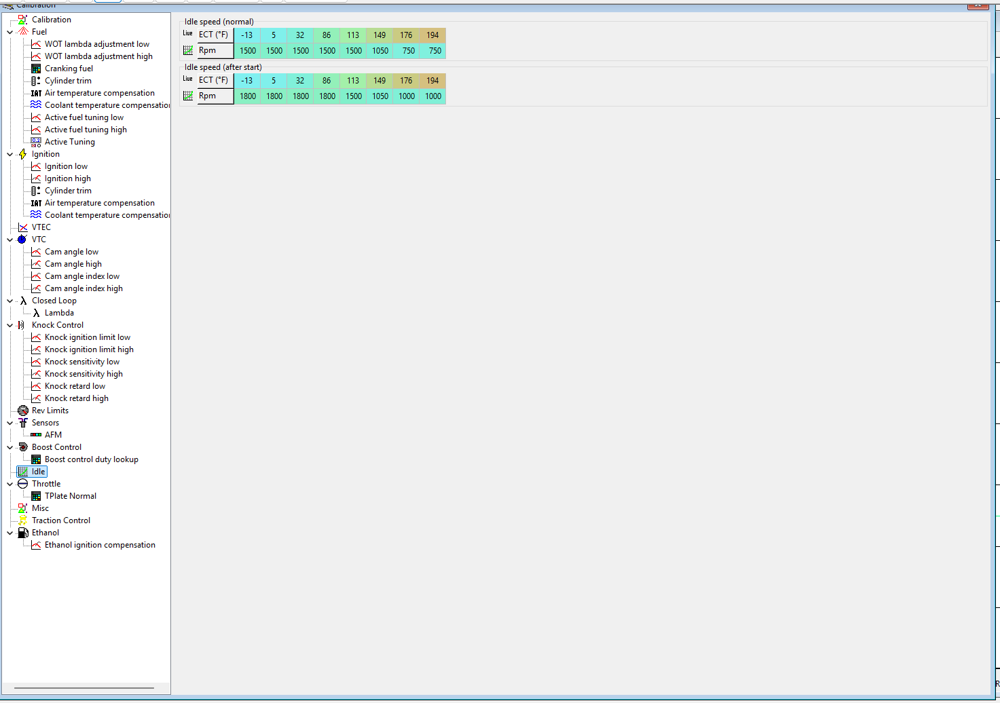
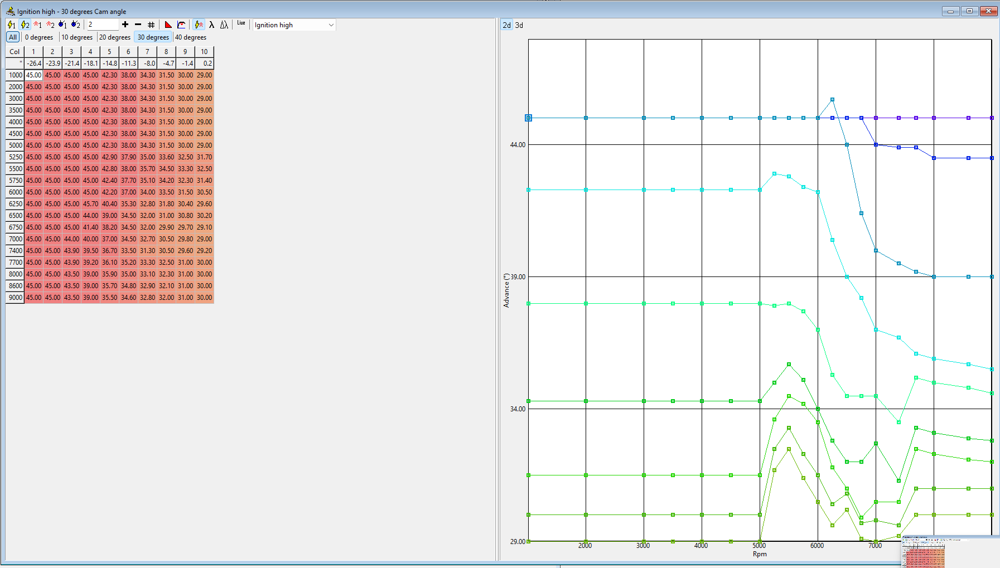
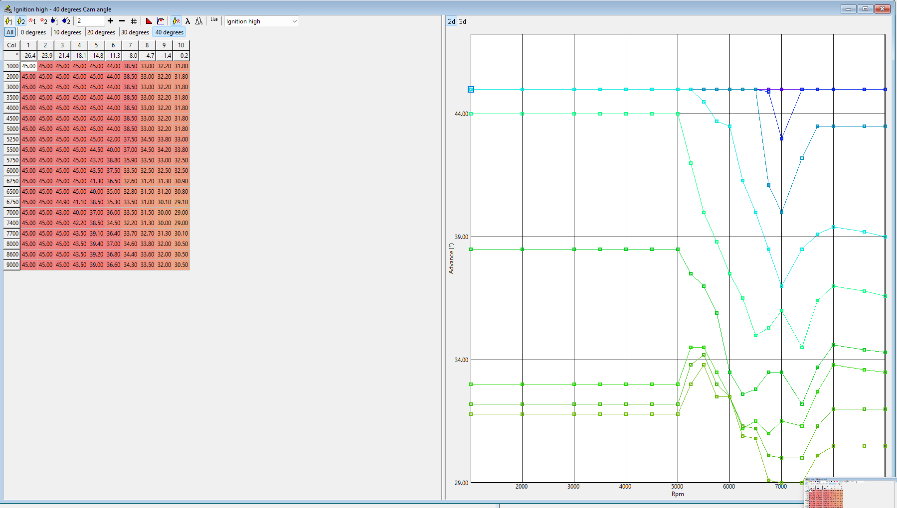
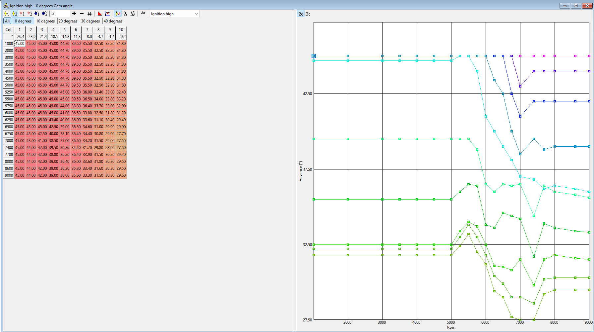
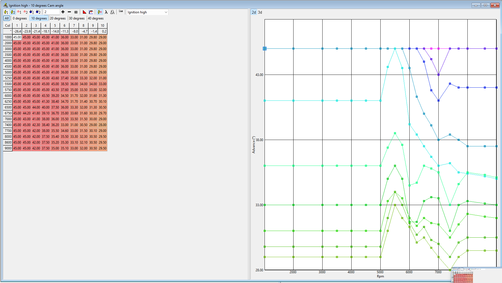
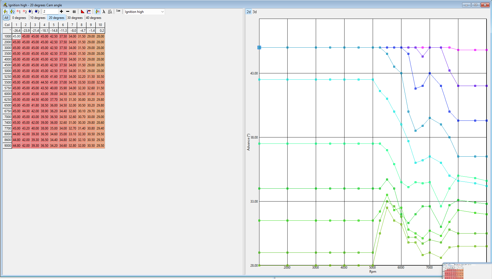
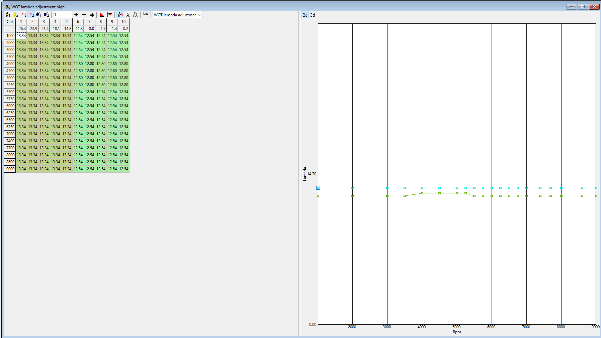
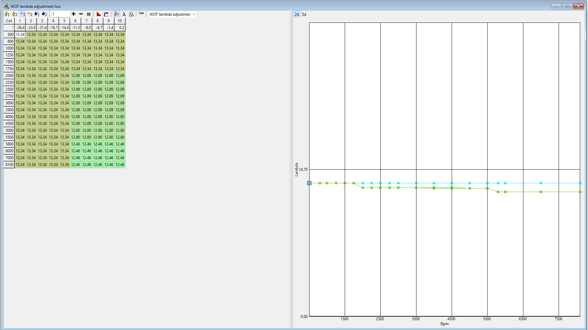
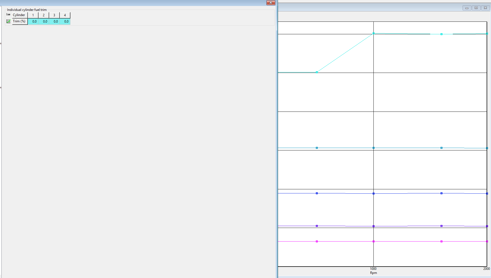
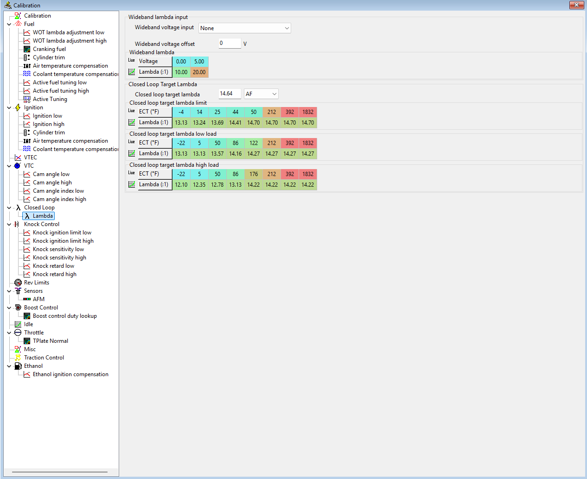

# Performance Tune 1 — Fix List (2026-04-20)

**Tune file:** `archive/2026-04-20_performance-tune.fpcal`
**Datalogs:** `datalogs/2026-04-20_pull-set-1/*.csv`
**Symptom:** Cylinder 1 knock during 4th-gear WOT pulls at 5000–5700 RPM, peak K.Retard 10°. No other cylinder retarded more than 2°.

This document is a concrete, cell-by-cell edit list for the next revision of the tune. Every change below has an image reference so you can open the exact tab in FlashProManager, click the exact cell, and type the new value.

---

## Navigation reference

Full calibration tree (reference shot):

Left pane in FlashProManager is grouped as: **Fuel · Ignition · VTEC · VTC · Closed Loop · Knock Control · Rev Limits · Sensors · Boost Control · Idle · Throttle · Misc · Traction Control · Ethanol**.

Every correction below names the tree node to click.

---

## Axis refresher (applies to every ignition + WOT-lambda table)

- **Rows = RPM** (500–9000 in 250–500 RPM steps).
- **Columns = MAP load** (inHg gauge). Column 1 = -26.4 (light cruise), Column 10 = +0.2 (WOT). WOT hits columns 6–10.
- **Cam-angle tabs** (All · 0° · 10° · 20° · 30° · 40°) switch between 3D slices. The final engine output is interpolated between the two nearest cam slices based on actual VTC position.

The knock happened when VTC cam was high (30–40° slice) at 5000–5700 RPM and load near column 5–6. That's where we edit.

---

## Correction 1 — Pull timing in the knock cells (critical, do first)

**Root cause of the Cyl 1 knock.** Datalog shows peak IGN = 34.4° at 5500 RPM, high cam, load column 5–6. K20Z3 community-safe ceiling at this RPM/load/cam is 26–28°. We are 6–8° over, and it knocked exactly as predicted.

### Tab 1: Ignition → Ignition high → **30 degrees** cam angle tab

Cells to edit (row = RPM, col = MAP index):

| RPM | Col 5 (-14.8) | Col 6 (-11.3) | Col 7 (-8.0) |
|-----|---------------|---------------|--------------|
| 5000 | **42.30 → 36.00** | **38.00 → 33.00** | **34.30 → 30.00** |
| 5250 | **42.90 → 36.00** | **37.90 → 33.00** | **35.00 → 30.00** |
| 5500 | **42.80 → 36.00** | **38.00 → 33.00** | **35.70 → 30.00** |
| 5750 | **42.40 → 35.50** | **37.70 → 32.50** | **35.10 → 29.50** |
| 6000 | **42.20 → 35.00** | **37.00 → 32.00** | **34.00 → 29.00** |

Net effect: -6° in the hottest cell, tapering to -5° by 6000 RPM. Leaves timing well inside the community-safe envelope at high cam.

### Tab 2: Ignition → Ignition high → **40 degrees** cam angle tab

Cells to edit:

| RPM | Col 5 (-14.8) | Col 6 (-11.3) | Col 7 (-8.0) |
|-----|---------------|---------------|--------------|
| 5000 | **45.00 → 37.00** | **38.50 → 33.00** | **33.00 → 30.00** |
| 5250 | **42.00 → 37.00** | **37.50 → 33.00** | **34.50 → 30.00** |
| 5500 | **44.50 → 37.00** | **37.00 → 33.00** | **34.50 → 30.00** |
| 5750 | **43.70 → 37.00** | **38.80 → 32.50** | **35.90 → 30.00** |
| 6000 | **43.50 → 36.00** | **37.50 → 32.00** | **33.50 → 29.00** |

The 40° cam slice had the most egregious values — 44.50° at 5500 RPM high load is pure fantasy for a 170k K20Z3 on 91 octane. -7° here.

### Verify the lower cam slices are already sane

Check these tabs quickly — they should already be well under 30° in the knock zone, but confirm visually:

- **Ignition high → 0° cam angle tab** (pre-VTEC, low-cam fallback):
  
- **10° cam angle tab:**
  
- **20° cam angle tab:**
  

If any cell in the 5000–6000 RPM × col 5–7 block exceeds 30° in the 20° tab, pull it to 28°. The 0° and 10° tabs are below VTEC engagement in practice, so they're less critical.

---

## Correction 2 — Richen WOT target from 12.54 to 12.20 at high RPM

Datalog shows actual AFR drifts 0.6–0.8 lean of commanded above 6500 RPM, indicating the stock fuel system is at capacity. Running a leaner target on top of that is what tipped Cyl 1 past the knock line. Richen the target until the Phase 12 DW300C pump and EV14 550cc injectors are in.

### Tab: Fuel → WOT lambda adjustment high

Cells to edit — all cells RPM ≥ 5500, cols 5–10:

| RPM | Col 5–10 current | Col 5–10 new |
|-----|------------------|--------------|
| 5500 | 12.54 | **12.20** |
| 5750 | 12.54 | **12.20** |
| 6000 | 12.54 | **12.10** |
| 6250 | 12.54 | **12.10** |
| 6500 | 12.54 | **12.00** |
| 6750 | 12.54 | **12.00** |
| 7000 | 12.54 | **12.00** |
| 7400+ | 12.54 | **12.00** |

Leave the 4000–5250 RPM block alone (already 12.80 — fine).

### Also check: Fuel → WOT lambda adjustment low

This is the low-cam slice (pre-VTEC). Should already be richer — confirm no WOT cells above 12.50. If any are leaner, pull them to 12.20.

---

## Correction 3 — Bias Cyl 1 fuel +3% until hardware is verified

This is a band-aid, not a fix. It hides the knock symptom while we figure out whether Cyl 1 is short on fuel because of an injector, a coil, a plug, or just because the spark arrived late. It costs us nothing at this mileage to be conservative with #1 until the Phase 15 ignition refresh is done.

### Tab: Fuel → Cylinder trim → **Individual cylinder fuel trim**

Change:

| Cylinder | Current | New |
|----------|---------|-----|
| 1 | 0.0 | **+3.0** |
| 2 | 0.0 | 0.0 |
| 3 | 0.0 | 0.0 |
| 4 | 0.0 | 0.0 |

Revisit this cell **after** Phase 15 Ignition Refresh. If Cyl 1 stops knocking with timing reduction and fresh plugs/coils, remove the trim.

---

## Correction 4 — Raise VTEC engagement from 4200 → 4500 RPM

Personal rule: VTEC stays at or above 4500 RPM until we've proven the low-cam tune is clean. Current engagement sits at 4200 which is lower than my build doc allows. Small fix, big peace of mind.

**Tab:** VTEC → VTEC window (the node directly under "VTEC" in the tree — sibling of VTC, not a child).

Change VTEC engagement threshold from 4200 RPM to 4500 RPM. Disengagement hysteresis stays at whatever Hondata's default gap is (typically 500 RPM lower, so 4000 RPM disengage — leave alone).

*No screenshot of this tab exists in the 2026-04-20 capture set — it wasn't one of the 48 tabs photographed. Navigate to it in FPM and match values. If the tab structure differs from what this doc implies, document it in a new screenshot next session.*

---

## Correction 5 — AFM recalibration for K&N Typhoon intake (tuner-territory)

The stock AFM calibration expects stock intake airflow characteristics. The K&N Typhoon CAI moves more air per unit voltage, which shows up as LTFT +14% and STFT +14–17% at idle on the stock tune. The ECU is compensating via fuel trims, which masks the real MAP/MAF curve and degrades every downstream calculation (timing, VTC target, knock thresholds).

**This is not a DIY cell edit.** The right approach is:
1. Log a steady-state cruise pass on the current tune at multiple load/RPM points.
2. Use the STFT+LTFT delta to generate an AFM scaling correction curve.
3. Apply the correction in **Sensors → AFM** (scalar or table, depending on FPM version).
4. Re-log and verify trims return to ±5%.

**Defer this until the actual dyno session.** A tuner with a sniffer will knock this out in 20 minutes. Attempting it blind from road data risks overcorrecting.

In the meantime: the +14% LTFT is annoying cosmetically but not dangerous — the ECU is successfully compensating. The knock was not caused by this.

---

## Related but not editing the tune file: Closed loop sanity

Noted for reference: Wideband voltage input is set to **None**. Once the AEM X-Series UEGO (Phase 17) is installed, set this to the correct analog input and populate the voltage→lambda table per the AEM spec sheet. Not relevant to the current knock fix — just a bookmark for Phase 17 work.

---

## Execute order

1. Open `archive/2026-04-20_performance-tune.fpcal` in FlashProManager.
2. File → **Save As** → `performance-tune-2.fpcal` (never edit the archive copy).
3. Apply **Correction 1** (the two ignition tables). This alone should stop the knock.
4. Apply **Correction 2** (WOT lambda high-cam richen).
5. Apply **Correction 3** (Cyl 1 +3% fuel trim).
6. Apply **Correction 4** (VTEC 4500 RPM engage).
7. Skip **Correction 5** until dyno day.
8. Flash, cold-start, verify idle trims haven't changed (baseline sanity).
9. Repeat pull set A (3rd gear 2500→7800) — a single pull is enough to confirm K.Retard stays at 0 on Cyl 1. If it does, we're done with this revision.
10. Archive the new `.fpcal` in `tune-profiles/archive/YYYY-MM-DD_performance-tune-2.fpcal`, add a new row to `tunes.md`, and start revision 2's profile doc.

---

## What I'm deliberately NOT changing

- **Rev limits** — already at 8200/8400 which is fine for this build.
- **Idle speed** — idle quality was acceptable in the datalog.
- **Cranking fuel** — no cold-start issues reported.
- **Air-temperature fuel compensation** — IAT stayed 95–110°F during logging, well inside the sane region of that table.
- **Knock sensitivity** — the ECU's knock control *worked correctly*, catching Cyl 1 at 10° retard. Don't blunt it.

The only reason the engine survived this pull is that knock control was doing its job. Keep it exactly as is.

---

*Last updated: 2026-04-20*
